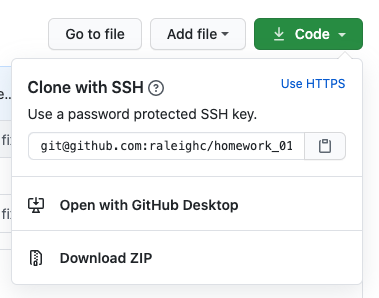
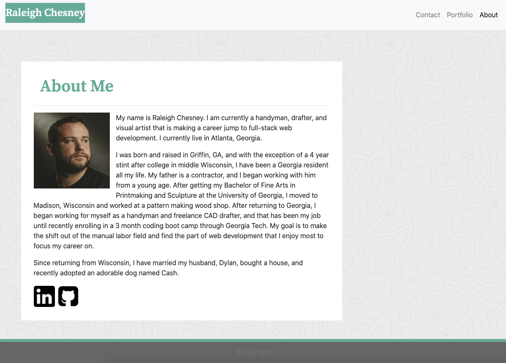

# My First Portfolio

My portfolio is a page to introduce myself and my work to potential customers.

[My Portfolio](https://raleighc.github.io/homework_02-Responsive_Portfolio/)

## Installation

Installation onto your device is cloned from the GitHub repository,
[My Portfolio Repository](https://github.com/raleighc/homework_02-Responsive_Portfolio),
using the "code" dropdown button, copy the "clone with SSH" text. 

Then, using terminal/gitbash, paste the address after the command "git clone" to retrieve the site files onto your local machine.

## Usage
This website consists of three pages:
* [About Me](https://raleighc.github.io/homework_02-Responsive_Portfolio/index.html)
* [Portfolio](https://raleighc.github.io/homework_02-Responsive_Portfolio/portfolio.html)
* [Contact](https://raleighc.github.io/homework_02-Responsive_Portfolio/contact.html)

It presents my work and personal information as well as gives potential clients links to my social media and a way to contact me. It is coded in a responsive format ready for use on mobile and PC.
Through a series of links in the navbar

potential customers can learn about my and my work and visit my linkedin and guthub pages for further professional information.

## Creating This Page

For this project I was provided with design images of how the website should look and used html, css, and boostrap to create to final product.
My main struggle for this page came from class and id organization between local css and boostrap css as well as use of the grid system to layout the page properly.
The responsive design through bootstrap made this page much easier to layout the initial skeleton and make the page more usable across different devices with ease.
HTML was validated using W3C Validation.

## Contributions

When contributing to this repository, please contact the owner of the repository before pushing any updates.
When contributions are accepted, please update the readme.md noting any changes that have been made.

## Authors and Acknowledgment

Thank you to all of my GT Bootcamp classmates who have offered advice and helped fix bugs alone the way.

The following list of resources were crucial in the creation of this site.

* [Bootstrap](https://getbootstrap.com/)
* [Google Custom Fonts](https://fonts.google.com/)
* [w3schools!](https://www.w3schools.com/bootstrap4/default.asp)
* [W3C Validation](https://validator.w3.org/)

## License

MIT License

Copyright (c) 2020 Raleigh Chesney

Permission is hereby granted, free of charge, to any person obtaining a copy
of this software and associated documentation files (the "Software"), to deal
in the Software without restriction, including without limitation the rights
to use, copy, modify, merge, publish, distribute, sublicense, and/or sell
copies of the Software, and to permit persons to whom the Software is
furnished to do so, subject to the following conditions:

The above copyright notice and this permission notice shall be included in all
copies or substantial portions of the Software.

THE SOFTWARE IS PROVIDED "AS IS", WITHOUT WARRANTY OF ANY KIND, EXPRESS OR
IMPLIED, INCLUDING BUT NOT LIMITED TO THE WARRANTIES OF MERCHANTABILITY,
FITNESS FOR A PARTICULAR PURPOSE AND NONINFRINGEMENT. IN NO EVENT SHALL THE
AUTHORS OR COPYRIGHT HOLDERS BE LIABLE FOR ANY CLAIM, DAMAGES OR OTHER
LIABILITY, WHETHER IN AN ACTION OF CONTRACT, TORT OR OTHERWISE, ARISING FROM,
OUT OF OR IN CONNECTION WITH THE SOFTWARE OR THE USE OR OTHER DEALINGS IN THE
SOFTWARE.
